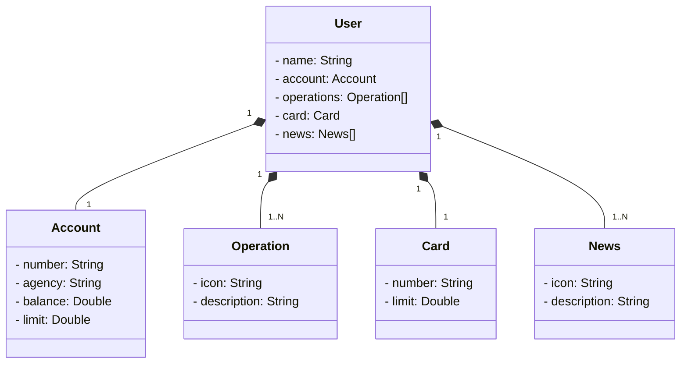

# Lab Final com Spring 3 e Railway
Projeto utilizando Java 17, Spring 3 e Railway para aprendizado do processode deploy de um projeto na nuvemm.

## Diagrama de Classes

```mermaid
classDiagram
    class User {
        - name: String
        - account: Account
        - operations: Operation[]
        - card: Card
        - news: News[]
    }

    class Account {
        - number: String
        - agency: String
        - balance: Double
        - limit: Double
    }

    class Operation {
        - icon: String
        - description: String
    }

    class Card {
        - number: String
        - limit: Double
    }

    class News {
        - icon: String
        - description: String
    }

    User "1" *-- "1" Account
    User "1" *-- "1..N" Operation
    User "1" *-- "1" Card
    User "1" *-- "1..N" News
```
